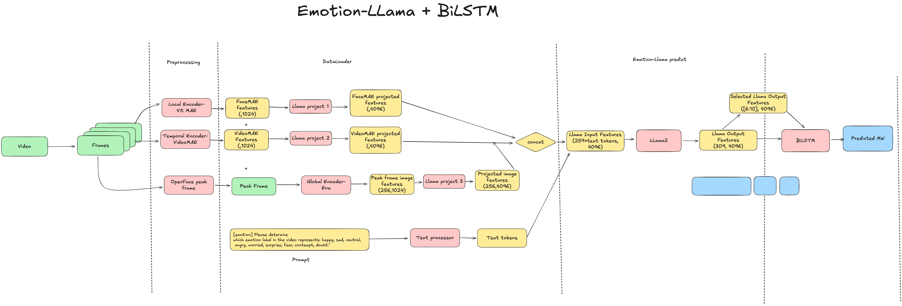

# Emotion-LLaMA: Multimodal Emotion Recognition and Mind Wandering Detection

This is a fork of the [Emotion-LLaMA GitHub repository](https://github.com/ZebangCheng/Emotion-LLaMA), used for experimenting with Emotion-LLaMA as an encoder for mind wandering detection.

The most useful code is located in the `minigpt4` folder, specifically in the `datasets`, `models`, `runners`, and `task` directories.

This iteration supports training Emotion-LLaMA end-to-end (in addition to using it as a feature extractor), though experiments with end-to-end training were unsuccessful.
For only feature extraction follow the following guideline:

## Pipeline Overview



## 🔍 Extracting Emotion-LLaMA Features from Frames


The codebase provides functionality to extract emotion-llama features from image frames. The main extraction pipeline consists of the following components:

### Main Function: `extract_model_features`

**Prerequisites**: Before extracting Emotion-LLaMA features, you must first extract FaceMAE and VideoMAE features:
- `extract_mae_embedding.py`: Extracts FaceMAE features from frames (e.g., `python extract_mae_embedding.py  --device='cuda:0'`)
- `extract_maeVideo_embedding.py`: Extracts VideoMAE features from videos (e.g., `python extract_maeVideo_embedding.py  --feature_level='UTTERANCE' --device='cuda:0'`)

### Standalone Extraction Script: `extract_emotion_llama_embeddings.py`

**File:** `extract_emotion_llama_embeddings.py`

This is a standalone script for batch extraction of Emotion-LLaMA embeddings from video datasets. It processes videos in a directory and saves the extracted embeddings as numpy arrays.

**Functionality:**
1. **Model Initialization**: Loads the Emotion-LLaMA model using the configuration file (default: `eval_configs/extract_embeddings.yaml`)
2. **Video Processing**: For each video in the dataset:
   - Loads the peak frame image from the specified directory
   - Loads pre-extracted FaceMAE features (`.npy` format)
   - Loads pre-extracted VideoMAE features (`.npy` format)
   - Creates dummy audio features (zeros, as audio is not used)
   - Concatenates video features: `[FaceMAE, VideoMAE, Audio]` → shape `[3, feature_dim]`
3. **Feature Extraction**: Uses `extract_model_features()` to:
   - Process images through the visual encoder (EVA model)
   - Project video features through projector layers
   - Pass concatenated embeddings through LLaMA model
   - Extract all hidden states from the last layer
4. **Output**: Saves embeddings as `.npy` files in the specified output directory

**Usage:**
```bash
python extract_emotion_llama_embeddings.py \
    --cfg-path eval_configs/extract_embeddings.yaml \
    --output_dir /path/to/output/directory \
    --device cuda:0
```

**Configuration:**
- The script expects specific directory paths (hardcoded in the script):
  - `peak_frame_dir`: Directory containing peak frame images
  - `face_dir`: Directory containing FaceMAE features
  - `mae_feature_dir`: Directory containing FaceMAE features (alternative path)
  - `maevideo_feature_dir`: Directory containing VideoMAE features
- Output directory can be specified via `--output_dir` argument (default: `/mnt/external_drive/Emotion-LLaMA/Features/Preprocessed_features_all/blur_0.0`)

**Output Format:**
- Each video's embeddings are saved as `{video_name}.npy`
- Shape: `(sequence_length, 4096)` - all hidden states from the last LLaMA layer

### Main Function: `extract_model_features`

**File:** `extract_emotion_llama_embeddings.py` (lines 9-57)

This is the core function for extracting emotion llama features from frames. It performs the following steps:

1. **Image and Video Feature Encoding**: Calls `model.preparing_embedding(samples)` which internally processes:
   - Images through the visual encoder (EVA model) → `[256, 4096]` image embeddings
   - Video features (FaceMAE and VideoMAE) through projector layers → `[2, 4096]` video embeddings
   - Concatenates: `[256 image patches + 2 video features + 1 CLS token] = [259, 4096]`

  

2. **LLaMA Processing**: Passes the concatenated embeddings through the LLaMA model to obtain hidden states

3. **Feature Extraction**: Extracts all hidden states from the last layer of the LLaMA model. 

**Output**: 
- Returns `llama_features`: All LLaMA hidden states from the last layer `[batch_size, sequence_length, 4096]`

### Key Model Methods

#### `model.encode_img(image, video_features)`
**File:** `minigpt4/models/minigpt_v2.py` (lines 92-118)

Encodes images and video features:
- Uses the visual encoder (EVA model) to process images
- Projects image features through `llama_proj` layer
- Projects video features (FaceMAE and VideoMAE) through separate projector layers
- Returns concatenated embeddings ready for LLaMA processing

#### `model.preparing_embedding(samples)`
**File:** `minigpt4/models/minigpt_base.py` (lines 289-340)

Orchestrates the embedding preparation:
- Calls `encode_img()` to get visual embeddings
- Wraps embeddings with text instructions
- Prepares tokens for the LLaMA model forward pass

### Usage Example

The `extract_model_features` function is called within `extract_emotion_llama_embeddings.py`:

```python
# Create samples dict with images and video features
samples = {
    'image': image,  # [batch_size, 3, 448, 448]
    'video_features': video_features,  # [batch_size, 3, 1024]
    'instruction_input': [instruction],
    'answer': ['']
}

# Extract features
llama_features = extract_model_features(model, samples)
```

The extracted features are saved as numpy arrays (`.npy` files) in the specified output directory.


## 📜 License
This repository is under the [BSD 3-Clause License](./LICENSE.md). The code is based on MiniGPT-4, which uses the BSD 3-Clause License (see [LICENSE_MiniGPT4.md](./LICENSE_MiniGPT4.md)). Data from MER2023 is licensed under [EULA](./LICENSE_EULA.md) for research purposes only.
